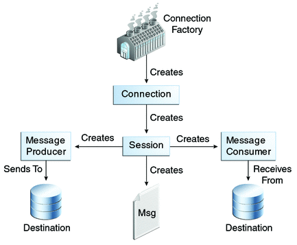

# JMS
JMS即Java消息服务（Java Message Service）应用程序接口，是一个 Java 平台中关于面向消息中间件（MOM）的 API，用于在两个应用程序之间，或分布式系统中发送消息，进行异步通信;

JMS是一种与厂商无关的 API，用来访问收发系统消息

## 消息通知模型

JMS消息通常有两种类型：

#### 点对点（Point-to-Point）  
在点对点的消息系统中，消息分发给一个单独的使用者。点对点消息往往与队列（javax.jms.Queue）相关联。

#### 发布/订阅（Publish/Subscribe）  
发布/订阅消息系统支持一个事件驱动模型，消息生产者和消费者都参与消息的传递。生产者发布事件，而使用者订阅感兴趣的事件，并使用事件。该类型消息一般与特定的主题（javax.jms.Topic）关联。


## 編程接口



- ConnectionFactory  连接工厂，由管理员创建，并绑定到 JNDI 树中。客户端使用 JNDI 查找连接工厂，然后利用连接工厂创建一个JMS连接。
- Connection  JMS 连接，线程安全，表示JMS客户端和服务器端之间的一个活动的连接，是由客户端通过调用连接工厂的方法建立的。
- Session  JMS 会话，非线程安全，表示 JMS 客户端与 JMS 服务器之间的会话状态。JMS 会话建立在 JMS 连接上，表示客户与服务器之间的一个会话线程。
- Destination  JMS目的地，又称为消息队列，是实际的消息源。
- MessageProducer  JMS 生产者，由 Session 创建，用于发送消息。
- MessageConsumer  JMS 消费者，由 Session 对象创建，用于接收消息。

#### 生产者发送消息示例
```java
public static void main(String[] args) {
	try {
		ConnectionFactory connectionFactory = new ActiveMQSslConnectionFactory("tcp://127.0.0.1:61616");
		Connection connection = connectionFactory.createConnection(); // 线程安全
		Session session = connection.createSession(false, Session.AUTO_ACKNOWLEDGE); // 非线程安全

		Topic topic = session.createTopic("topic-test");
		// Queue queue = session.createQueue("topic-queue");
		MessageProducer producer = session.createProducer(topic);
		producer.setDeliveryMode(DeliveryMode.PERSISTENT); // 消息持久化
		producer.setTimeToLive(3*24*60*60*1000L); // 消息存活事件

		connection.start(); //start放后面

		// 发送消息
		Message message = session.createTextMessage("hello jms");
		producer.send(message);

		producer.close();
		session.close();
		connection.close();
	} catch (JMSException e) {
		e.printStackTrace();
	}
}
```

# 消息可靠性

## 事务

#### 生产者事务
```java
// 第一个参数是是否创建session，第二个参数表示应答模式
// 事务的配置优先度高于应答模式（签收）
Session session = connection.createSession(true,Session.AUTO_ACKNOWLEDGE);
```

不开启事务时
只要执行send就进入到队列中

开启事务后
需要在最后使用session.commit();,某一条异常也可以用session.rollback();

#### 消费者事务
不开启事务时
消息拿到就算作被消费了

开启事务时
没有commit，消息就不会算作被消费。会有重复消费的可能

## 签收

签收偏消费者

#### 非事务模式

- Session.AUTO_ACKNOWLEDGE  
自动签收（默认）

- Session.CLIENT_ACKNOWLEDGE  
手动签收；客户端调用acknowledge方法手动签收

- Session.DUPS_OK_ACKNOWLEDGE  
允许重复消息;消息可重复确认，意思是此模式下，可能会出现重复消息，并不是一条消息需要发送多次ACK才行。
它是一种潜在的"AUTO_ACK"确认机制，为批量确认而生，而且具有“延迟”确认的特点。对于开发者而言，这种模式
下的代码结构和AUTO_ACKNOWLEDGE一样，不需要像CLIENT_ACKNOWLEDGE那样调用acknowledge()方法来确认消息

#### 事务模式下
消费者事务开启，只有commit后才能将全部消息变为已消费，写ack没有作用，即使写了签收也不会签收出队

#### 和事务的联系
- 在事务性会话中，当一个事务被成功提交则消息被自动签收。如果事务回滚，则消息会被再次传送
- 非事务会话中，消息何时被确认取决于创建会话时的应答模式（acknowledgement）

## 参考
[JMS入门简介](https://www.cnblogs.com/liqipiao/p/11099031.html)
[ActiveMQ笔记（三）如何保证消息可靠性](https://blog.csdn.net/m0_38060977/article/details/103751868)
[简单jms连接池和一点使用心得](https://blog.csdn.net/chitankong1289/article/details/100935489)