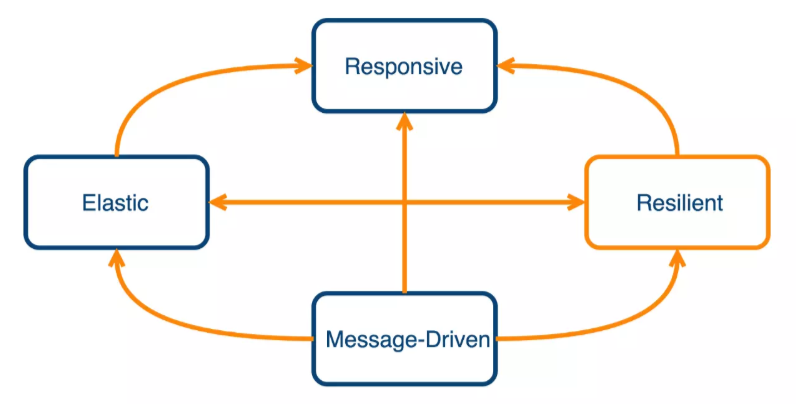

## 

## 相关文档
1. [Reactor Reference Guide](https://projectreactor.io/docs/core/release/reference/)

2. [RxJava 从入门到放弃再到不离不弃](https://www.zdltech.com/archives/1428.html)

2. [（11）照虎画猫深入理解响应式流规范——响应式Spring的道法术器](https://blog.csdn.net/get_set/article/details/79514670)

3. [Reactor Mono和Flux 进行反应式编程详解](https://blog.csdn.net/ZYC88888/article/details/103679605)

4. [Reactive(1) 从响应式编程到"好莱坞"](https://www.cnblogs.com/littleatp/p/11386487.html)

5. [教你轻松理解Rxjava之线程切换流程(observeOn与subscribeOn)](https://blog.csdn.net/wenyingzhi/article/details/80453464)

## 响应式系统宣言
[响应式系统宣言](https://www.reactivemanifesto.org/)



在这个宣言里面，对于响应式的系统特征定义了四个特性：

及时响应(Responsive)：系统能及时的响应请求。
有韧性(Resilient)：系统在出现异常时仍然可以响应，即支持容错。
有弹性(Elastic)：在不同的负载下，系统可弹性伸缩来保证运行。
消息驱动(Message Driven)：不同组件之间使用异步消息传递来进行交互，并确保松耦合及相互隔离。
在响应式宣言的所定义的这些系统特征中，无一不与响应式的流有若干的关系，于是乎就有了 2013年发起的 响应式流规范(Reactive Stream Specification)。

## 响应式流规范(Reactive Stream Specification)

[响应式流规范(Reactive Stream Specification)](https://www.reactive-streams.org/)

其中，对于响应式流的处理环节又做了如下定义：

具有处理无限数量的元素的能力，即允许流永不结束
按序处理（单个流）
异步地传递元素
实现非阻塞的负压(back-pressure)
负压这个概念或许有些陌生，但本质是为了协调流的处理能力提出的，对于流处理来说会分为 Publisher(发布者) 和Subscriber(订阅者)两个角色，
可看做生产者与消费者的模式。当发布者产生的消息过快时，订阅者的处理速度可能会跟不上，此时可能会导致一系列的系统问题。 因此负压的目的
就是定义一种反馈机制，让订阅者(消费方)向发布者告知其自身的状态(包括处理速度)，尽可能让发布方作出调整，本质上是一种系统自我保护的手段。 
说到这里，不得不想到TCP的 MTU协商了

## 为什么要使用Reactive

Reactive响应式编程提出了一种更高级的抽象，将数据的处理方式沉淀到可复用的库之后可以提高开发的效率。

[tosee](https://yq.aliyun.com/articles/617709)

## 发布-订阅模式（Publish-Subscribe）& 观察者模式（Observer） & 生产者（producer）-消费者（consumer）模式
所谓模式，就是在某种场景下，一类问题及其解决方案的总结归纳。

生产者消费者模式：生产者将消息发送到消息中心，消费者从消息中心获取消息进行消费。

发布订阅模式：发布者将事件（或者说消息）发送到消息中心，订阅者从消息中心订阅自己感兴趣的消息。生产者和消费者完全解耦。

观察者模式（Observer）: 观察者（Observer）订阅被观察者（Observable），事件来临时，被观察者直接将事件发送给观察者。生产者和消费者有所关联。

生产者消费者模式是这一类模式的通称；

如果将消息分类（topic, queue），消费者只处理自己感兴趣的消息，那么便可称之为发布订阅模式；

如果去掉消息中心，生产者直接将消息发送给消费者，则可称之为观察者模式。

一般情况，pub-sub 模式和 observer 区别就是有没有消息中心。

然而有时也将观察者模式等同于发布订阅模式（不做严格区分）。

因此不用过于纠结某种方案究竟是哪种模式，心里总体有个概念就可以了。

模式是解决问题的方案，模式本身不应该成为问题。

## From 不支持异步

```java
@Test
public void onTest() {
	Flux
			.create(it -> {
				TestHelper.printCurrentThread("create");
				it.next(1);
				it.complete();
			})
			.doOnSubscribe(it -> TestHelper.printCurrentThread("doOnSubscribe1"))
			.subscribeOn(Schedulers.newElastic("subscribeOn1"))
			.doOnSubscribe(it -> TestHelper.printCurrentThread("doOnSubscribe2"))
			.subscribeOn(Schedulers.newElastic("subscribeOn2"))
			.doOnNext(it -> TestHelper.printCurrentThread("doOnNext1"))
			.publishOn(Schedulers.newElastic("publishOn1"))
			.doOnSubscribe(it -> TestHelper.printCurrentThread("doOnSubscribe3"))
			.doOnNext(it -> TestHelper.printCurrentThread("doOnNext2"))
			.subscribe(it -> TestHelper.printCurrentThread("subscribe"));
}
```
> TestHelper.printCurrentThread 仅打印当前线程。

结果如下：
```
【doOnSubscribe3】 method running in thread: <<main>>
【doOnSubscribe2】 method running in thread: <<subscribeOn2-5>>
【doOnSubscribe1】 method running in thread: <<subscribeOn1-6>>
【create】 method running in thread: <<subscribeOn1-6>>
【doOnNext1】 method running in thread: <<subscribeOn1-6>>
【doOnNext2】 method running in thread: <<publishOn1-4>>
【subscribe】 method running in thread: <<publishOn1-4>>
```
先从下往上看，只关注订阅操作符：
doOnSubscribe3 运行时并没有调用 subscribeOn 指定线程，因此运行在 main;
doOnSubscribe2 下面调用 subscribeOn 指定了线程 subscribeOn2，因此运行在 subscribeOn2；
doOnSubscribe1 下面调用 subscribeOn 指定了线程 subscribeOn1, 因此运行在 subscribeOn1；
create         下面调用 subscribeOn 指定了线程 subscribeOn1, 因此运行在 subscribeOn1；

调用 create 后处于线程 subscribeOn1，从上往下看， 只关注数据流运算符：
doOnNext1 上面没有调用 publishOn 指定线程，因此运行在 subscribeOn1;
doOnNext2 上面调用 publishOn 指定了线程 publishOn1，因此运行在 publishOn1;
subscribe 上面调用 publishOn 指定了线程 publishOn1，因此运行在 publishOn1;

# 示例
下面的实例，在Observable.OnSubscribe的call()中模拟了长时间获取数据过程，在Subscriber的noNext()中显示数据到UI。
```java
Observable.create(new Observable.OnSubscribe<String>() {
     @Override
     public void call(Subscriber<? super String> subscriber) {
         subscriber.onNext("info1");
  
         SystemClock.sleep(2000);
         subscriber.onNext("info2-sleep 2s");
  
         SystemClock.sleep(3000);
         subscriber.onNext("info2-sleep 3s");
  
         SystemClock.sleep(5000);
         subscriber.onCompleted();
     }
 })
.subscribeOn(Schedulers.io()) //指定 subscribe() 发生在 IO 线程
.observeOn(AndroidSchedulers.mainThread()) //指定 Subscriber 的回调发生在主线程
.subscribe(new Subscriber<String>() {
    @Override
    public void onCompleted() {
        Log.v(TAG, "onCompleted()");
    }
  
    @Override
    public void onError(Throwable e) {
        Log.v(TAG, "onError() e=" + e);
    }
  
    @Override
    public void onNext(String s) {
        showInfo(s); //UI view显示数据
    }
});
```

至此，我们可以看到call()将会发生在 IO 线程，而showInfo(s)则被设定在了主线程。这就意味着，即使加载call()耗费了几十甚至几百毫秒的时间，也不会造成丝毫界面的卡顿。

## 线程控制
- subscribeOn(): 指定 subscribe() 所发生的线程，即 Observable.OnSubscribe 被激活时所处的线程。或者叫做事件产生的线程。
- observeOn(): 指定 Subscriber 所运行在的线程。或者叫做事件消费的线程。
注意：observeOn() 指定的是 Subscriber 的线程，而这个 Subscriber 并不一定是 subscribe() 参数中的 Subscriber（这块参考RxJava变换部分），而是 observeOn() 执行时的当前 Observable 所对应的 Subscriber ，即它的直接下级 Subscriber 。

换句话说，observeOn() 指定的是它之后的操作所在的线程。因此如果有多次切换线程的需求，只要在每个想要切换线程的位置调用一次 observeOn() 即可。

## Publisher.subscribe(Subscriber)
支持背压，调用 request 后流程才会开始
onSubscribe -> Subscription#request（背压） -> onNext -> onSuccess -> onComplete

## publishOn & subscribeOn

先理一下基本流程。

Publisher（也称 Observable, Provider）发射一系列事件，这些事件数据流经过不同的操作符处理，会被转换成不同的 Publisher 对象，
直到最后调用 Publisher.subscribe(Subscriber) 与 Subscriber（也称 Observer, Consumer）发生订阅关系，从而被不同的订阅者消费掉。

数据流经过运算符处理，从上游 Publisher 流向下游 Publisher，即数据流的方向为**从上往下**，下游 Publisher 接收上游 Publisher 的数据，即订阅的方向为**从下往上**

总结：订阅操作向上走，数据流的操作向下走。

publishOn：切换【数据流的操作符】所在线程，即从上往下（数据流的方向），每次调用 publishOn 会改变下游的数据流运算符所在线程。

subscribeOn：切换【订阅的操作符】所在线程，即从下往上（订阅的方向），每次调用 subscribeOn 会改变上游的订阅操作符所在线程。

因此，当我们调用了 subscribe 的发起订阅

1. 向上走,我只需要关心 subscribeOn 和订阅的操作符

2. 向下走,我只需要关心 observeOn 和数据流的操作符

【订阅运算符】：从 onSubscribe（不包括）开始，到发射元素之前的所有操作。比如：create, doOnSubscribe, doOnRequest
【数据流运算符】：从发射元素开始，到订阅结束之间的操作。比如： map, filter, flatMap, subscribe

注意： onSubscribe 及之前的操作都发生在主线程（当前线程）中。
> Subscriber#onSubscribe 方法始终运行在当前线程，不受线程调度管理
示例：
```java
@Test
public void threadTest() {
	Flux.create(it -> {
		TestHelper.printCurrentThread("from");
		it.next(1);
		it.complete();
	})

			.doOnSubscribe(it -> {
				TestHelper.printCurrentThread("doOnSubscribe1");
			})
			.subscribeOn(Schedulers.newElastic("subscribeOnThread1"))
			.doOnSubscribe(it -> {
				TestHelper.printCurrentThread("doOnSubscribe2");
			})
			.subscribeOn(Schedulers.newElastic("subscribeOnThread2"))
			.doOnNext(it -> {
				TestHelper.printCurrentThread("doOnNext1");
			})
			.publishOn(Schedulers.newElastic("publishOnThread1"))
			.doOnSubscribe(it -> {
				TestHelper.printCurrentThread("doOnSubscribe3");
			})
			.doOnNext(it -> {
				TestHelper.printCurrentThread("doOnNext2");
			})
			.subscribe(it -> {
				TestHelper.printCurrentThread("subscribe");
			});
}
```

## subscribe
这里规定 subscribe 的第一个参数称为 consumer, 第二个参数称为 errorConsumer, 第三个参数称为 completeConsumer

consumer 发生的异常不会被 onErrorContinue 捕获，可以被 errorConsumer 捕获，此时

### doOnError
处理错误，但不捕获（异常会调到 errorConsumer 处理，走异常流程）,当存在 onErrorContinue （无论在之前或之后调用）时，此函数不会生效，
会直接由 onErrorContinue 处理。

### onErrorContinue
处理并且捕获异常，后面不会调用 errorConsumer，算正常流程

onErrorContinue 只能捕获它之前的异常

onErrorContinue 不能捕获 doOnEach 的异常， doOnEach 的异常可以被 doOnError 处理，最终被 errorConsumer 捕获。

### errorConsumer
errorConsumer 指 subscribe 的第二个参数

create 方法抛出的异常可以被它捕获。
from 方法抛出的异常无法捕获

## doOnEach 
每次 publisher 发射一个事件，调用一次

发射的事件包括：onNext， onError, onComplete

doOnEach 发生的异常不会被 onErrorContinue 捕获，但可以被 doOnError 处理，然后被 errorConsumer 捕获。

## doOnNext
每次发射一个 onNext 事件，调用一次

## doFinally 
当发布事件结束（正常或异常）时调用。
注意：当 consumer 发生异常时，会先调用 doFinally 在调用 errorConsumer。
正常流程 -> consumer -> onComplete -> doFinally
异常流程 -> doOnError -> errorConsumer -> doFinally
consumer 发生异常 -> consumer -> doFinally -> errorConsumer

## flatMap
每个流会单独计算并返回，因此可以实现最快计算。


