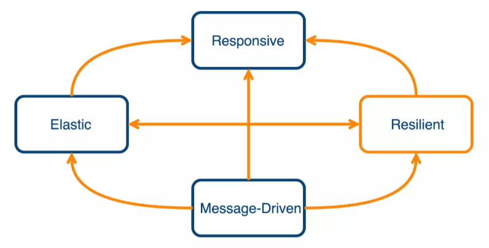

## 

## 相关文档
1. [Reactor Reference Guide](https://projectreactor.io/docs/core/release/reference/)


2. [（11）照虎画猫深入理解响应式流规范——响应式Spring的道法术器](https://blog.csdn.net/get_set/article/details/79514670)

3. [Reactor Mono和Flux 进行反应式编程详解](https://blog.csdn.net/ZYC88888/article/details/103679605)

参考： [Reactive(1) 从响应式编程到"好莱坞"](https://www.cnblogs.com/littleatp/p/11386487.html)

## 响应式系统宣言
[响应式系统宣言](https://www.reactivemanifesto.org/)



在这个宣言里面，对于响应式的系统特征定义了四个特性：

及时响应(Responsive)：系统能及时的响应请求。
有韧性(Resilient)：系统在出现异常时仍然可以响应，即支持容错。
有弹性(Elastic)：在不同的负载下，系统可弹性伸缩来保证运行。
消息驱动(Message Driven)：不同组件之间使用异步消息传递来进行交互，并确保松耦合及相互隔离。
在响应式宣言的所定义的这些系统特征中，无一不与响应式的流有若干的关系，于是乎就有了 2013年发起的 响应式流规范(Reactive Stream Specification)。

## 响应式流规范(Reactive Stream Specification)

[响应式流规范(Reactive Stream Specification)](https://www.reactive-streams.org/)

其中，对于响应式流的处理环节又做了如下定义：

具有处理无限数量的元素的能力，即允许流永不结束
按序处理
异步地传递元素
实现非阻塞的负压(back-pressure)
负压这个概念或许有些陌生，但本质是为了协调流的处理能力提出的，对于流处理来说会分为 Publisher(发布者) 和Subscriber(订阅者)两个角色，可看做生产者与消费者的模式。当发布者产生的消息过快时，订阅者的处理速度可能会跟不上，此时可能会导致一系列的系统问题。 因此负压的目的就是定义一种反馈机制，让订阅者(消费方)向发布者告知其自身的状态(包括处理速度)，
尽可能让发布方作出调整，本质上是一种系统自我保护的手段。 说到这里，不得不想到TCP的 MTU协商了

## 为什么要使用Reactive

Reactive响应式编程提出了一种更高级的抽象，将数据的处理方式沉淀到可复用的库之后可以提高开发的效率。

[tosee](https://yq.aliyun.com/articles/617709)

## From 不支持异步

```java
@Test
    public void fromTest() {
        Flux.from((Publisher<String>) it -> {
            it.onNext("22");
            it.onNext("23");
//            it.onError(new Throwable("error"));
            it.onNext("24");
            it.onComplete();
            // from 不支持异步 用 create, 上面 it 会报空指针异常
        }).publishOn(Schedulers.newElastic("my")).map(it -> {
            System.out.println(it);
            return it;
        }).subscribe(it -> {
            System.out.println("subscribe:" + it);
        }, e -> {
            System.out.println(e.getMessage());
        }, () -> {
            System.out.println("end");
        });
    }
```

## publish & subscribe

publish：修改下一个运算符运行所在线程
subscribe：设定默认的线程，与所在位置无关