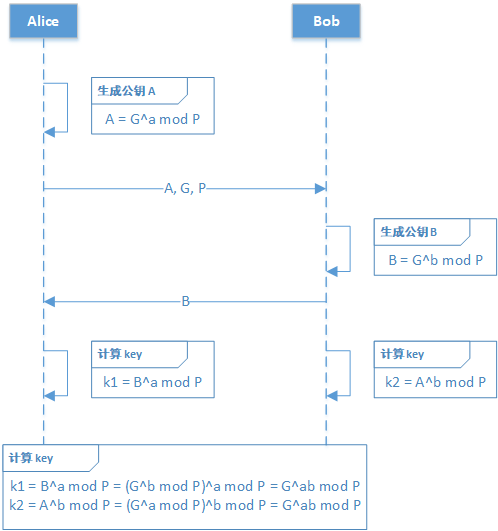

**DH秘钥交换算法：** DH的全称为Diffie-Hellman ，该算法可以在需要安全传输的前提下，确定双方的对称秘钥，该算法的核心在于双方的私钥没有进入网络传输流程，根据对方的公钥和己方的私钥，可以计算出同样的Key。攻击方即便获取到了公钥和P，G值，也无法计算出Key值。

**公钥：** 会进入网络传输的秘钥部分，该部分是公开的。

**私钥：** 由端自己保存的秘钥部分，该部分不允许公开。

**DK：** 加密算法中，用X对敏感数据进行加密后，再用Key对X加密得到DK，然后X就被舍弃了，这里的X没有持久化，使用完内存就被销毁，攻击者需要得到敏感数据，就必须得到X，然后X已经被销毁了，破解方必须通过DK去破解出X，DK是通过Key来保护的，只要保证Key是安全的，敏感数据就是安全的。

**Key：** 通过对方公钥和己方私钥生成的Key值，只要私钥不被破解，该值就是安全的。

**Token认证：** 接口的安全认证，这个token生成可以单独拎出来讲一篇文章，涉及到另一套安全方案，这里不赘述。

**SID：** 握手标识，由客户端生成，用户A和用户B握手后，双方需要记录握手成功后的SID和DH秘钥交换中生成的Key。后续通信时，服务端通过请求header中的SID和DK来知道该如何解密敏感信息。
十六进制编码：字节在传输过程中，如果使用一般的编码，会导致网络传输后出现丢失字节的情况，这时就要使用到十六进制编码，在本文中，统一用S（byte[]）来标示字符数组的十六进制编码处理。

**AES-supports：** 加密用的规则，请求方所支持的AES加密种类，如果支持多个，用分号分割。平台内支持的规则是固定的，由库中决定。

**AES-param：** 响应方从请求方的AES-supports挑选一个随机的加密方法，作为本次加密使用的AES规则。

## 原理
