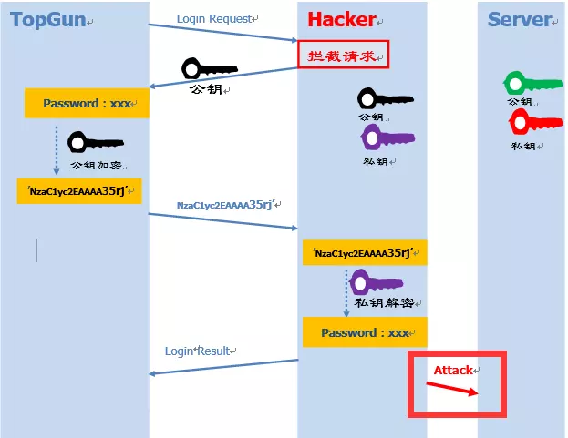
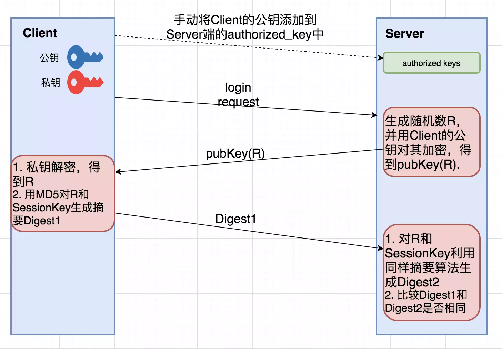

# SSH

SSH是一种协议标准，其目的是实现安全远程登录以及其它安全网络服务。

## 数据加密

加密的方式主要有两种：

- 对称加密（也称为秘钥加密） 
加密解密使用同一套密钥。如下图


缺点：无法保证密钥安全，可能被截获。

- 非对称加密（也称公钥加密）
非对称加密有两个密钥：“公钥”和“私钥”。公钥加密后的密文，只能通过对应的私钥进行解密。而通过公钥推理出私钥的可能性微乎其微。


1. 远程Server收到Client端用户TopGun的登录请求，Server把自己的公钥发给用户。
2. Client使用这个公钥，将密码进行加密。
3. Client将加密的密码发送给Server端。
4. 远程Server用自己的私钥，解密登录密码，然后验证其合法性。
5. 若验证结果，给Client相应的响应。

缺点：中间人攻击。Client 端如何保证接受到的公钥就是目标Server端的？，如果一个攻击者中途拦截Client的登录请求，向其发送自己的公钥，Client端用攻击者的公钥进行数据加密。攻击者接收到加密信息后再用自己的私钥进行解密，不就窃取了Client的登录信息了吗？这就是所谓的中间人攻击



## SSH

SSH 基于非对称算法，他用下面两种方式避免中间人攻击

### 1. 基于口令的认证
SSH的publish key和private key都是自己生成的，没法公证。只能通过Client端自己对公钥进行确认。通常在第一次登录的时候，系统会出现下面提示信息：
```sh
The authenticity of host 'ssh-server.example.com (12.18.429.21)' cant be established.
RSA key fingerprint is 98:2e:d7:e0:de:9f:ac:67:28:c2:42:2d:37:16:58:4d.
Are you sure you want to continue connecting (yes/no)?
$ yes

# 提示追加到文件 ~/.ssh/known_hosts 中
Warning: Permanently added 'ssh-server.example.com,12.18.429.21' (RSA) to the list of known hosts. 
Password: (enter password) 
```
### 2. 基于公钥认证
每次登录都需要输入密码，很麻烦。SSH提供了另外一种可以免去输入密码过程的登录方式：**公钥登录**



1. Clien 将自己的公钥存放在 Server 上，追加在文件 ~/.ssh/authorized_keys 中。
2. Server 端接收到Client的连接请求后，会在 authorized_keys 中匹配到 Client 的公钥 pubKey，并生成随机数 R，用 Client 的公钥对该随机数进行加密得到 pubKey(R)
，然后将加密后信息发送给 Client。
3. Client端通过私钥进行解密得到随机数 R，然后对随机数 R 和本次会话的 SessionKey 利用 MD5 生成摘要 Digest1，发送给 Server 端。
4. Server 端会也会对 R 和 SessionKey 利用同样摘要算法生成 Digest2。
5. Server 端会最后比较 Digest1 和 Digest2 是否相同，完成认证过程。

### 操作

```sh
# -t 表示密钥类型
$ ssh-keygen -t rsa -P '' -f ~/.ssh/id_rsa
$ cat ~/.ssh/id_rsa.pub >> ~/.ssh/authorized_keys
$ chmod 0600 ~/.ssh/authorized_keys

# 登录
# 以用户名user，登录远程主机host
$ ssh user@host

# 本地用户和远程用户相同，则用户名可省去
$ ssh host

# SSH默认端口22，可以用参数p修改端口
$ ssh -p 2017 user@host
```

#### ~/.ssh 中有四个文件
1. id_rsa：保存私钥
2. id_rsa.pub：保存公钥
3. authorized_keys：保存已授权的客户端公钥
4. known_hosts：保存已认证的远程主机ID（关于known_hosts详情，见文末更新内容）

**参考： [图解SSH原理](https://www.cnblogs.com/diffx/p/9553587.html)**