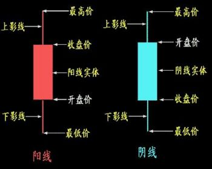

## K 线 
   

K 线就是指将各种股票每日、每周、每月的开盘价、收盘价、最高价、最低价等涨跌变化状况，用图形的方式表现出来 K线最上方的一条细线称为上影线，中间的一条粗线为实体。下面的一条细线为下影线。当收盘价高于开盘价，也就是股价走势呈上升趋势时，我们称这种情况下的 K线为阳线，中部的实体以空白或红色表示。这时，上影线的长度表示最高价和收盘价之间的价差，实体的长短代表收盘价与开盘价之间的价差，下影线的长度则代表开盘价和最低价之间的差距。

【指标】

能够全面透彻地观察到市场的真正变化。我们从K线图中，既可看到股价（或大市）的趋势，也同时可以了解到每日市况的波动情形。

> 上影线表示卖压，下影线表示买压，中间表示实体（股价波动）
> 上影线越长（大于实体），卖压越大，股价上涨具有阻力；下影线越长（大于实体），买压越大，股价可能上涨

【说明】  
1．长红线或大阳线

　　此种图表示最高价与收盘价相同，最低价与开盘价一样。上下没有影线。从一开盘，买方就积极进攻，中间也可能出现买方与卖方的斗争，但买方发挥最大力量，一直到收盘。买方始终占优势，使价格一路上扬，直至收盘。表示强烈的涨势，股市呈现高潮，买方疯狂涌进，不限价买进。握有股票者，因看到买气的旺盛，不愿抛售，出现供不应求的状况。

　　2．长黑线或大阴线

　　此种图表示最高价与开盘价相同，最低价与收盘价一样。上下没有影线。从一开始，卖方就占优势。股市处于低潮。握有股票者不限价疯狂抛出，造成恐慌心理。市场呈一面倒，直到收盘、价格始终下跌，表示强烈的跌势。

　　3．先跌后涨型

　　这是一种带下影线的红实体。最高价与收盘价相同，开盘后，卖气较足，价格下跌。但在低价位上得到买方的支撑，卖方受挫，价格向上推过开盘价，一路上扬，直至收盘，收在最高价上。总体来讲，出现先跌后涨型，买方力量较大，但实体部分与下影线长短不同，买方与卖方力量对比不同。

　　实体部分比下影线长。价位下跌不多，即受到买方支撑，价格上推。破了开盘价之后，还大幅度推进，买方实力很大。

　　实体部分与下影线相等，买卖双方交战激烈，但大体上，买方占主导地位，对买方有利。

　　实体部分比下影线短。买卖双方在低价位上发生激战。遇买方支撑逐步将价位上推。但从图中可发现，上面实体部分较小，说明买方所占据的优势不太大，如卖方次日全力反攻，则买方的实体很容易被攻占。

　　4．下跌抵抗型

　　这是一种带下影线的黑实体，开盘价是最高价。一开盘卖方力量就特别大，价位一直下跌，但在低价位上遇到买方的支撑。后市可能会反弹。实体部分与下影线的长短不同也可分为三种情况：

　　（1）实体部分比影线长表示卖压比较大，一开盘，大幅度下压，在低点遇到买方抵抗，买方与卖方发生激战，影线部分较短，说明买方把价位上推不多，从总体上看，卖方占了比较大的优势。

　　（2）实体部分与影线同长表示卖方把价位下压后，买方的抵抗也在增加，但可以看出，卖方仍占优势。

　　（3）实体部分比影线短卖方把价位一路压低，在低价位上，遇到买方顽强抵抗并组织反击，逐渐把价位上推，最后虽以黑棒收盘，但可以看出卖方只占极少的优势。后市很可能买方会全力反攻，把小黑实体全部吃掉。

　　5．上升阻力

　　这是一种带上影线的红实体。开盘价即最低价。一开盘买方强盛，价位一路上推，但在高价位遇卖方压力，使股价上升受阻。卖方与买方交战结果为买方略胜一筹。具体情况仍应观察实体与影线的长短。

　　红实体比影线长，表示买方在高价位是遇到阻力，部分多头获利回吐。但买方仍是市场的主导力量，后市继续看涨。

　　实体与影线同长，买方把价位上推，但卖方压力也在增加。二者交战结果，卖方把价位压回一半，买方虽占优势。但显然不如其优势大。

　　实体比影线短。在高价位遇卖方的压力、卖方全面反击，买方受到严重考验。大多短线投资者纷纷获利回吐，在当日交战结束后，卖方已收回大部分失地。买方一块小小的堡垒（实体部分）将很快被消灭，这种K线如出现在高价区，则后市看跌。

　　6．先涨后跌型

　　这是一种带上影线的黑实体。收盘价即是最低价。一开盘，买方与卖方进行交战。买方占上风，价格一路上升。但在高价位遇卖压阻力，卖方组织力量反攻，买方节节败退，最后在最低价收盘，卖方占优势，并充分发挥力量，使买方陷入"套牢"的困境。 具体情况仍有以下三种：

　　（1）黑实体比影线长，表示买方把价位上推不多，立即遇到卖方强有力的反击，

　　把价位压破开盘价后乘胜追击，再把价位下推很大的一段。卖方力量特别强大，局势对卖方有利。

　　（2）黑实体与影线相等，买方把价位上推；但卖方力量更强，占据主动地位。卖方具有优势。

　　（3）黑实体比影线短，卖方虽将价格下压，但优势较少，明日入市，买方力量可能再次反攻，黑实体很可能被攻占。

　　7．反转试探型 　　 　　这是一种上下都带影线的红实体。开盘后价位下跌，遇买方支撑，双方争斗之后，买方增强，价格一路上推，临收盘前，部分买者获利回吐，在最高价之下收盘。这是一种反转信号。如在大涨之后出现，表示高档震荡，如成交量大增，后市可能会下跌。如在大跌后出现，后市可能会反弹。这里上下影线及实体的不同又可分为多种情况：

　　（1）上影线长于下影线之红实体：又分为：影线部分长于红实体表示买方力量受挫折。红实体长于影线部分表示买方虽受挫折，但仍占优势。

　　（2）下影线长于上影线之红实体：亦可分为：红实体长于影线部分表示买方虽受挫折，仍居于主动地位。影线部分长于红实体表示买方尚需接受考验。

　　8．弹升试探型

　　这是一种上下都带影线的黑实体，在交易过程中，股价在开盘后，有时会力争上游，随着卖方力量的增加，买方不愿追逐高价，卖方渐居主动，股价逆转，在开盘价下交易，股价下跌。在低价位遇买方支撑，买气转强，不至于以最低价收盘。有时股价在上半场以低于开盘价成交，下半场买意增强，股价回至高于开盘价成交，临收盘前卖方又占优势，而以低于开盘价之价格收盘。这也是一种反转试探。如在大跌之后出现，表示低档承接，行情可能反弹。如大涨之后出现，后市可能下跌。

　　9．十字线型

　　这是一种只有上下影线，没有实体的图形。开盘价即是收盘价，表示在交易中，股价出现高于或低于开盘价成交，但收盘价与开盘价相等。买方与卖方几乎势均力敌。 其中：上影线越长，表示卖压越重。下影线越长，表示买方旺盛。上下影线看似等长的十字线，可称为转机线，在高价位或低价位，意味着出现反转。

　　10．"┴"图形

　　又称空胜线，开盘价与收盘价相同。当日交易都在开盘价以上之价位成交，并以当日最低价（即开盘价）收盘，表示买方虽强，但卖方更强，买方无力再挺升，总体看卖方稍占优势，如在高价区，行情可能会下跌。 "Ｔ"图形又称多胜线，开盘价与收盘价相同，当日交易以开盘价以下之价位成交，又以当日最高价（即开盘价）收盘。卖方虽强，但买方实力更大，局势对买方有利，如在低价区，行情将会回升。

　　11．"一"图形

　　此较形不常见，即开盘价、收盘价、最高价、最低价在同一价位。只出现于交易非常冷清，全日交易只有一档价位成交。冷门股此类情形较易发生。

## 相关文档
1. [K线理论](https://wiki.mbalib.com/wiki/K%E7%BA%BF)