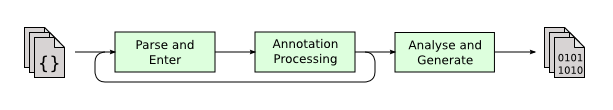

## 什么是 Lombok
```
Project Lombok is a java library that automatically plugs into your editor and build tools, spicing up your java.
Never write another getter or equals method again, with one annotation your class has a fully featured builder, Automate your logging variables, and much more.
```

简单来说： Lombok能以简单的注解形式来简化 java 代码，自动生成 constructor, getter, setter 和一些通用的方法(toString, hashCode, equals)，从而提高开发人员的开发效率。

## Lombok 使用

### 1. 添加 maven 依赖

```xml
<dependency>
    <groupId>org.projectlombok</groupId>
    <artifactId>lombok</artifactId>
    <!-- Only needed at compile time -->
    <scope>compile</scope>
</dependency>
```

### 2. 安装 lombok 插件
Lombok 需要将相关注解的代码编译成对应的方法（getter, setter 等），因此需要插件的支持。

【安装方式】：

idea -> ctrl + shift + a -> 输入 plugins -> 搜索 lokbok -> install

> 如果编译时出错，可能是没有开启 Annotation Processors。 开启方式 ctrl + shift + a -> Annotation Processors -> Enable annotation processing 

### 3. 使用

```java
import lombok.Data;

@Data
public class Foo {
    private String name;
    private int age;
}
```

测试

```java
@Test
public void fooTest() {
    Foo foo1 = new Foo(); // 生成了无参构造器
    foo1.setAge(2); // 生成了 setter

    Foo foo2 = new Foo();
    foo2.setAge(2);

    // 结果为 true, 因为根据所有的字段（非 transient）重写了 equals 方法
    System.out.println(foo1.equals(foo2));

    // Foo(name=null, age=2) 重写了 toString 方法
    System.out.println(foo1.toString());
}
```

## 常用注解

#### @Data
1. 无参构造器
2. 生成 getter（所有字段）， setter（non-final 字段）
3. 重写了 toString， hashCode 和 equals（non-transient 字段）

#### @Getter/@Setter
1. 用与类上，为所有的字段生成 getter/setter
2. 用在字段上，为该字段生成 getter/setter

#### @ToString 
注解在类，添加 toString 方法

#### @EqualsAndHashCode 
注解在类，生成 hashCode 和 equals 方法

#### @NoArgsConstructor 
注解在类，生成无参的构造方法。

#### @RequiredArgsConstructor 
注解在类，为类中需要特殊处理的字段生成构造方法，比如 final 和被 @NonNull 注解的字段

#### @AllArgsConstructor 
注解在类，生成包含类中所有字段的构造方法

## 原理
自动生成的代码到底是如何产生的呢？ 核心之处就是对于注解的解析上。JDK5引入了注解的同时，也提供了两种解析方式。

### 运行时解析
运行时能够解析的注解，必须将@Retention设置为RUNTIME，这样就可以通过反射拿到该注解。

### 编译时解析
JSR 269 在 jdk6 加入了 Pluggable Annotation Processing API 作为 APT（Annotation Processing Tool）的替代方案。javac 在执行的时候会调用实现了该 API 的程序，这样我们就可以对编译器做一些增强，javac 执行的过程如下



Lombok 本质上就是一个实现了“JSR 269 API”的程序。在使用 javac 的过程中，它产生作用的具体流程如下：
1. javac 对源代码进行分析，生成了一棵抽象语法树（AST）
2. 运行过程中调用实现了“JSR 269 API”的Lombok程序
3. 此时 Lombok 就对第一步骤得到的AST进行处理，找到 @Data 注解所在类对应的语法树（AST），然后修改该语法树（AST），增加 getter 和 setter 方法定义的相应树节点
4. javac使用修改后的抽象语法树（AST）生成字节码文件，即给 class 增加新的节点（代码块）